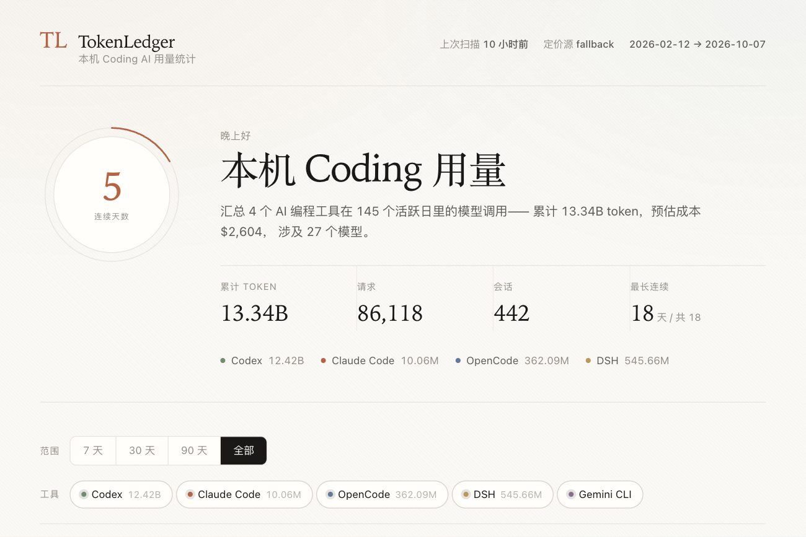

# TokenLedger

统计本机所有 coding 相关 AI 工具的模型用量，给出可视化与流程动画。

支持的工具（可扩展）：**Codex**、**Claude Code**、**OpenCode**、**DSH (DeepSeek Harness)**、**Gemini CLI**。



界面采用 Anthropic 风格的设计语言：暖调象牙白纸感、细发丝线分隔、
衬线体标题与数字、珊瑚色作为唯一强调色，克制而编辑感强。

## 安装

**桌面应用**（推荐，无需 Node）：从 [Releases](https://github.com/Daidai-star/tokenledger/releases) 下载对应平台的安装包。

| 平台 | 安装包 | 说明 |
| --- | --- | --- |
| macOS (Apple Silicon) | `.dmg` | 未签名，首次打开需在「系统设置 → 隐私与安全性」放行 |
| macOS (Intel) | `.dmg` | 同上 |
| Windows (x64) | `.msi` / `.exe` | NSIS 安装器为当前用户安装，无需管理员 |

**自己跑**（需要 Node.js ≥ 24，用到内置的 `node:sqlite` 与 `node:zlib` 的 zstd）：

```bash
npm install
npm run build      # 构建前端
npm start          # 启动服务（首次启动会自动全量扫描）
# 打开 http://127.0.0.1:8787
```

开发模式（前端热更新）：

```bash
npm run dev        # vite:5173 + api:8787，/api 已配好代理
npm run desktop:dev  # Tauri 桌面应用（会先打包 sidecar）
```

不想起服务，只想要一份统计：

```bash
npm run scan                # 扫描并打印总览
npm run scan -- --tool codex   # 只扫某个工具
npm run reset               # 清库全量重扫
node server/cli.js stats    # 打印当前统计
node server/cli.js export out.json   # 导出 JSON
```

## 数据从哪来

每个工具都有本地日志，TokenLedger 只读这些文件，不做任何网络请求、不上传任何数据。

| 工具 | 数据源 | 拿到的指标 |
| --- | --- | --- |
| Codex | `~/.codex/sessions/**/rollout-*.jsonl` + `.jsonl.zst` | token_count 增量、模型（turn_context）、cwd、originator |
| Claude Code | `~/.claude/projects/**/*.jsonl` | assistant 消息的 usage（input/output/cache） |
| OpenCode | `~/.local/share/opencode/opencode.db` | assistant 消息的 tokens/cost/model |
| DSH | `~/.dsh/sessions/**/session.v4.jsonl.zstd` | assistant/message 的 usage、provider、model |
| Gemini CLI | `~/.gemini/tmp/**/*.json` | usageTokens |

> Codex 会把较老的会话压成 `.jsonl.zst`，内容与 `.jsonl` 完全一致。
> **两者都要读**——只认 `.jsonl` 会漏掉绝大部分历史（本机实测少采约 8.4B token）。
> `.bak` 是 zst 的备份副本，跳过以免重复计数。

### 口径归一化

各工具的日志结构不同，collector 负责把差异消化掉，产出统一的 `UsageEvent`：

- **`inputTokens` 一律表示「新鲜输入」**。Codex 的 `input_tokens` 实际包含 `cached_input_tokens`，采集时做了减法，与 OpenCode / Claude 的口径对齐，避免下游重复计费。
- **total = input + output + cacheRead + cacheWrite**。缓存读算进总量，否则 Codex 这种高缓存命中的工具会被严重低估。
- **Codex 的 token_count 是累计值**，取 `last_token_usage` 作为单次增量；`total_token_usage` 只用来交叉校验。
- **`event_id` 保证幂等**：重复扫描同一文件不会重复计数。

### 增量扫描

`file_cursors` 表记录每个文件读到哪个字节。下次扫描：

- 文件未增长且 mtime 未变 → 跳过
- 文件被截断（size < offset）→ 从头重读（靠 `event_id` 幂等兜底）
- JSONL 用字节级读取，只在完整行边界停下，多字节 UTF-8 跨块不会损坏

**游标与数据必须同时落盘。** 采集器把一个工具的事件先攒在内存里，
等 `scan()` 返回才批量入库；而游标若逐文件实时写入，进程中途被杀就会出现
「游标已推进、数据还在内存里」的窗口——重启后这些文件被当成未变更跳过，
数据永久丢失。所以游标先攒着，`insertEvents` 成功后才提交；collector 抛错则丢弃，
下次从头重读（`event_id` 幂等，不会重复计数）。`server/scanner.cursor.test.js` 锁住这个行为。

大文件优化：Codex 单个 rollout 文件可达数 GB，且 99% 的行是消息正文。
采集器用字节级 `bytesFilter` 粗筛，只对含 `"token_count"` 等标记的行付出 `JSON.parse` 成本。

zstd 有两种形态，处理方式不同：

- **Codex 的 `.jsonl.zst` 是单帧**，用内置 `zlib.createZstdDecompress()` 流式解压。
  实测 395 个文件（1.37 GB 压缩 / 约 5 GB 解压）全部为单帧。
  分片解压并定期让出事件循环，所以扫描期间 SSE 进度仍能实时刷出。
- **DSH 的 session 文件是多帧拼接的 zstd**，Node 内置 API 只解第一帧，
  所以优先走系统 `zstd -dc`，退化时按帧魔数切分逐帧解压。

本机全量扫描（461 个 Codex 文件 + 395 个 `.zst`）约 25 秒。

## 成本估算

日志自带成本时直接采信（OpenCode 的 `cost` 字段）。否则按 `USD / 1M tokens` 计价：

1. `~/.cc-switch/model-pricing.json`（与 cc Switch 同源，优先）
2. 内置价目表 + 家族兜底

家族兜底处理网关自定义命名（`gpt-6-luna`、`claude-opus-5`、`deepseek-v4.1-flash`），
这些没有公开价目，按最接近的公开档位估算，`cost_source` 标为 `builtin~est` 以示区分。

```
cost_source: reported        日志自带
             cc-switch       本地价目表命中
             builtin         内置表精确命中
             builtin~est     家族估算（不确定）
             unknown         无价目，成本按 0 计入并在 UI 提示
```

## 可视化

- **用量趋势** — 堆叠面积图，可切 Token / 请求 / 成本，点模型可下钻
- **Token 速率** — 见下节
- **工具占比** — 环形图
- **Token 构成** — 缓存命中 / 新鲜输入 / 输出 / 推理 / 缓存写入
- **模型排行** — 按量排序，点击联动趋势图下钻
- **活跃热力图** — GitHub 风格年度热力图（Codex profile 的标志性视觉）
- **工具 × 模型矩阵** — 交叉热力，点击格子聚焦模型
- **时段活跃** — 24 小时分布
- **成本构成** + 工具明细表
- **最近会话 / 最近请求** — 实时事件流
- **购买力** — 见下节
- **分享卡片** — 见下节

## Token 速率（吞吐）

用量总量说明不了「强度」。速率统计回答的是：**你真正在写代码的时候，token 烧得多快。**

事件是「一次请求完成」的瞬时记录，所以速率按**分钟分桶**计算——
每分钟的 token 数 = 该分钟内所有请求的 token 之和。
分桶用 `strftime(..., 'localtime')`，保证小时/日期与本机时区一致。

指标分五层：

| 层级 | 内容 |
| --- | --- |
| `overall` | 活跃分钟数、活跃时长、平均 / 中位数 / P95 / 峰值速率，峰值时刻与当时的工具构成 |
| `byDay` | 每日速率曲线（活跃分钟内的 tok/min） |
| `byHour` | 24 小时速率画像，找出高产时段 |
| `byTool` | 各工具速率对比 |
| `recent` | 最近 60 分钟的逐分钟滚动速率 |

分母用**活跃分钟**而不是全部时间——否则「一周没写代码」会把平均值稀释得毫无意义。
中位数单列出来，因为速率是长尾分布，均值会被个别峰值拉偏。

本机当前读数：活跃时段平均 636.3K tok/min，中位数 433.8K，P95 1.67M，
峰值 579.37M tok/min（2026-07-17 00:52，单场长上下文会话），
累计活跃 349 小时 / 20,963 个有请求的分钟。

按工具看，DSH / OpenCode / Claude Code 的单位时间吞吐都在 914K~992K tok/min，
Codex 因为会话跨度长、总活跃分钟多（20,284 min），平均到 612.3K tok/min——
但它的绝对量占了全机 93%。

## 购买力

把累计账单折算成实物——「这些 API 的钱能买什么」。纯本地计算，不联网。

```
累计账单折合 ¥1.9 万 / 一万九千零五元
已经能拿下  🔋 RTX 5090 显卡
再攒 ¥3,795 就能拿下  🚲 碳纤维电动公路车
```

三个层次，从信息到情绪：

- **对数标尺** — 15 件商品横跨 ¥88 ~ ¥5800 万，跨 6 个数量级，
  所以位置一律用对数比例（线性轴上便宜的会全挤在左边）。
  买得起的刻度实心珊瑚色，买不起的灰点，「你在这里」标出当前站位。
- **下一个目标** — 最便宜的买不起的那件，配进度条。
  留白比成就更有牵引力，所以给它单独一整条。
- **购物车** — 「如果真拿这笔钱去买」。先给每件买得起的都来一件
  （由便宜到贵，尽量凑齐品类），再用零钱回头补最便宜的。

购物车不用纯贪心「从便宜往贵买到钱花完」：那会把整笔预算砸在最便宜的单一商品上
（实测 ¥18,842 全变成 214 包咖啡豆，购物车退化成一行，信息量归零）。

价格是 2026 年国内**参考零售价**，汇率取固定的 `1 USD = ¥7.2`（非实时），
两者都在界面上标注清楚。这是个趣味估算，不伪装成精确报价。

## 分享卡片

点「分享这张账」在本机画一张 PNG（Canvas 2D，2400×1260），
含累计消费力、四个核心指标、工具占比条，底部注明「数据全部来自本机，不上传」。

没用 html2canvas 或 SVG `foreignObject`：后者在 Windows WebView2 里常因字体与
CSS 继承而失真，而引入第三方库会破坏「零依赖、纯本地」的定位。
代价是排版手写，但卡片布局是固定的。

**生成后存到本地，由用户自己决定发不发。** 不经过任何服务器。

## 流程动画

`采集流程` 面板把扫描过程做成可视流水线：

`检测工具 → 解析日志 → 写入存储 → 聚合 → 完成`

- 阶段节点依次点亮，连接线填充
- 进度条按文件数推进，带流光
- 正在处理的工具高亮，节点呼吸 + 圆点脉冲
- 进度通过 SSE（`/api/scan/stream`）实时推送，扫描完成后自动刷新数据

其余动效：入场淡入上移、数字滚动、条形图生长、环形图弧线扫出、
hover tooltip、状态切换过渡；并遵循 `prefers-reduced-motion`。

## 架构

```
server/
├── model.js              UsageEvent / Collector 契约（扩展点）
├── pricing.js            成本估算
├── store.js              SQLite：事件表、游标、扫描记录、日聚合
├── scanner.js            扫描编排 + 进度事件
├── queries.js            聚合查询
├── index.js              HTTP 服务 + SSE
├── cli.js                命令行
└── collectors/
    ├── util.js           遍历 / 增量 JSONL 读取 / zstd 流式解压 / 字节过滤
    ├── codex.js  claude-code.js  opencode.js  dsh.js  gemini.js
    └── index.js          注册表
web/src/
├── App.tsx               页面编排、筛选、指标卡
├── mall.ts               购买力换算（纯函数，含金额与中文数字格式化）
├── share.ts              分享卡片绘制（Canvas 2D）
├── components/
│   ├── Charts.tsx        自绘 SVG 图表集（趋势/排行/环形/柱状/热力/矩阵）
│   ├── Mall.tsx          购买力区
│   └── ScanFlow.tsx      采集流程动画
├── api.ts  format.ts  types.ts  styles.css
scripts/
├── build-sidecar.mjs     打包桌面应用用的 sidecar
└── build-sidecar.test.js 参数解析契约的回归测试
desktop/src-tauri/
├── src/main.rs           极薄外壳：选端口 / 拉起后端 / 健康检查 / 开窗口 / 退出时回收
├── tauri.conf.json
└── Cargo.toml
```

后端零运行时依赖：SQLite 用 Node 内置 `node:sqlite`，zstd 用 `node:zlib`，HTTP 用 `node:http`。
前端图表全部自绘 SVG，没有引入图表库。

### 桌面应用架构：Tauri 薄壳 + Node sidecar

为什么不是 Electron：整个后端（8 GB 日志解析、多帧 zstd、SQLite 聚合）是零依赖的
Node 实现，重写一遍不划算。所以**保留 Node，把 Tauri 只当壳**——Rust 侧只做四件事：

1. 挑一个空闲端口
2. 拉起打包进来的 Node 运行时，跑 `server.mjs`
3. 轮询 `/api/health`，确认后端就绪
4. 打开系统 WebView 指向该端口；退出时杀掉子进程

健康检查用 `std::net` 直接发 HTTP，不引入 `reqwest`。

体积对比（实测）：

| | DMG |
| --- | --- |
| 本方案（Node 114 MB + Tauri 壳 4.1 MB） | **37.9 MB**（gzip 36 MB） |
| Electron | ~85 MB |

sidecar 由 `scripts/build-sidecar.mjs` 生成：`esbuild` 把后端打成单文件
`server.mjs`、拷贝 `dist/` 前端产物、下载对应平台的 Node 运行时。
用 `--platform` / `--arch` 支持交叉架构（CI 构建 Intel 包时必需）。

## 扩展一个新工具

实现 `Collector` 契约，加进 `collectors/index.js` 即可，存储/聚合/API/前端都不用改：

```js
// server/collectors/mytool.js
import { UsageEvent, Collector } from "../model.js";
import { walkFiles, readJsonlIncremental, toTs, hashId } from "./util.js";

export const mytool = new Collector({
  id: "mytool",
  name: "My Tool",
  color: "#ff6b6b",
  roots: ["/path/to/logs"],
  detect: () => true,
  async scan(ctx) {
    const events = [];
    for (const file of walkFiles(ctx.roots.mytool, { exts: [".jsonl"] })) {
      const cur = ctx.cursor("mytool", file);
      const res = readJsonlIncremental(file, cur.reset ? null : cur, (obj) => {
        events.push(new UsageEvent({
          id: hashId("mytool", obj.requestId),  // 幂等键
          tool: "mytool",
          ts: toTs(obj.timestamp),
          model: obj.model,
          inputTokens: obj.usage?.input || 0,
          outputTokens: obj.usage?.output || 0,
        }));
      });
      ctx.advance("mytool", file, res);       // 保存游标
      ctx.emitProgress("mytool", events.length, 1, 1);
    }
    return { events, stats: { filesSeen: 1, filesParsed: 1 } };
  },
});
```

`ctx` 提供：`cursor()` / `advance()` / `session()` / `emitProgress()`。

## API

| 端点 | 说明 |
| --- | --- |
| `GET /api/dashboard` | 首屏全量数据 |
| `GET /api/overview` | 总览指标 |
| `GET /api/timeseries` | 时间序列（`?byTool=true` 按工具拆） |
| `GET /api/by-model` | 模型排行 |
| `GET /api/by-tool` | 工具对比 |
| `GET /api/matrix` | 工具 × 模型 |
| `GET /api/hourly` `?weekday` | 时段分布 |
| `GET /api/rate` | Token 速率统计 |
| `GET /api/sessions` `?events` | 会话 / 事件流 |
| `GET /api/profile` | 档案（streak、强度） |
| `GET /api/profiles/:tool` | 单工具账号信息 |
| `POST /api/scan` | 触发扫描 |
| `POST /api/reset` | 清库重扫 |
| `GET /api/scan/stream` | SSE 扫描进度 |

通用参数：`from` / `to`（YYYY-MM-DD）、`tools`（逗号分隔）、`limit`。

## 测试

```bash
npm test           # 118 个用例
npm run typecheck
```

覆盖：

- **增量读取** — 截断 / 跨块 UTF-8 / 坏行 / 去重
- **zstd 流式解压** — 跨块边界不截断行、末尾无换行的最后一行、字节过滤、损坏文件抛错
- **游标提交时机** — collector 崩溃时不提交游标、崩溃后重跑能补齐数据
- **定价** — 缓存不重复计费 / 家族兜底
- **幂等写入**、聚合与主键冲突、查询筛选、streak 计算
- **扫描编排** — 并发保护 / 错误隔离 / 增量跳过 / reset
- **速率统计** — 分钟分桶、中位数与 P95、峰值归属
- **购买力换算** — 金额守恒、品类多样性、零/负/非法预算、中文数字读法
- **sidecar 参数解析** — `--key=value` 与 `--key value` 两种形式

`web/src/*.test.ts` 由 Node 内置的类型剥离直接运行，不参与 `tsc` 类型检查
（已在 `tsconfig.json` 中排除，否则 Node 全局会漏进浏览器代码）。

## 隐私

只读本机日志，**不发起任何网络请求，不上传任何数据**。数据库留在本地。
桌面应用把后端跑在 `127.0.0.1` 的随机端口上，不对外监听。

分享卡片在本机生成 PNG，存到本地后由用户自己决定发不发。

> 设计上刻意不做排行榜。coding agent 日志的敏感度远高于普通使用统计：
> `cwd` 常含公司名与私有项目名，上传时间序列足以反推作息与大致位置。
> 如果以后要加，建议保持纯本地，最多做成与历史快照的对比。

截图与文档里的项目路径均为 `…/` 开头的相对展示，不含用户名或绝对路径。

## License

未附带许可证。默认保留所有权利，其他人无权复制、修改或分发本项目的代码。
仅供阅读参考。

## 数据存储

命令行模式下数据库在 `~/.tokenledger/tokenledger.db`（SQLite，WAL）。
删除该文件即可完全重置；`TOKENLEDGER_DATA` 环境变量可改位置。

桌面应用改用 Tauri 的 app data 目录：

- macOS `~/Library/Application Support/dev.daidai.tokenledger/data/`
- Windows `%APPDATA%\dev.daidai.tokenledger\data\`
